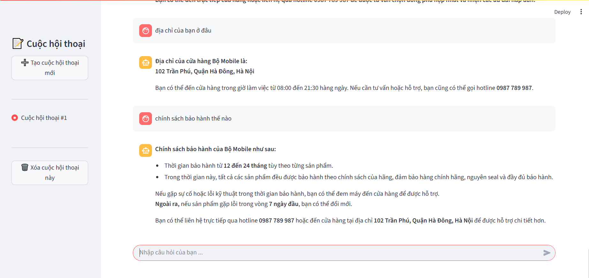

# Chatbot Phone

## Introduction

This project is a phone consulting chatbot that leverages Retrieval-Augmented Generation (RAG) to provide accurate and helpful information based on vector and SQL data. The chatbot can answer questions about phone specifications, prices, reviews, and more.

## Overview




## Features
- **Smartphone Q&A Chatbot** – answers user queries about smartphones.  
- **Advanced RAG System** – uses LangChain to fetch relevant information from databases.  
- **Query Rewrite & Router** – rewrite queries based on chat history and route them to the right retriever.  
- **Hybrid Search** – combines:
  - **Semantic search (vector embeddings in Milvus)**  
  - **Keyword search (BM25)**  
- **SQL Search with PostgreSQL** – supports structured queries (e.g., filter by brand, RAM, storage, price).  
- **Streaming LLM Responses** – tokens are streamed back to the frontend as soon as they are generated.
- **Streamlit Web UI** – simple and interactive chat interface.  
- **FastAPI Backend** – provides REST APIs for chatbot and data retrieval.  
- **Scalable Database Design** – hybrid of vector DB (Milvus) + relational DB (Postgres).  
- **Modular Architecture** – backend/frontend separation for flexibility.  

## Tech Stack

**Frontend:**  
- [Streamlit] – UI framework for chatbot interface  

**Backend:**  
- [FastAPI] – high-performance API framework  

**Databases:**  
- [Milvus] – vector database for embeddings + hybrid search  
- [PostgreSQL] – relational database for structured queries  

**Core AI / NLP:**  
- [LangChain] – framework for Retrieval-Augmented Generation (RAG)  
- Embedding Models – used for semantic search in Milvus (use model of HunggingFace)
- LLM - use API of OpenAI

## Installation

1. **Clone the repository**:
   ```
   git clone https://github.com/your-username/phone-consultation-chatbot.git
   cd phone-consultation-chatbot
   ```

2. **Create a virtual environment**:
   ```
   python -m venv venv
   source venv/bin/activate  # On Windows: venv\Scripts\activate
   ```

3. **Install dependencies**:
   ```
   pip install -r requirements.txt
   ```

4. **Set up Databases**:
   - **Milvus**: Run Milvus via Docker:
     ```
     docker run -d -p 19530:19530 -p 19121:19121 milvusdb/milvus:latest
     ```
     Connect via the SDK in the code.
   - **PostgreSQL**: Run via Docker:
     ```
     docker run -d -p 5432:5432 -e POSTGRES_PASSWORD=yourpassword -e POSTGRES_DB=POSTGRES_DB postgres:latest
     ```
     Create schema and import data (e.g., phone product table).

5. **Configure Environment**:
   Create a `.env` file with the following variables:
   ```
   OPEN_API_KEY = YOUR_OPEN_API_KEY
   ```

## Running the Application

1. **Run the Backend (FastAPI)**:
   ```
   cd app
   uvicorn main:app --reload
   ```
   The API will be available at `http://localhost:8000`. Main endpoints:
   - `/query`: Handles chatbot queries (POST with query in body).

2. **Run the Frontend (Streamlit)**:
   ```
   cd web
   streamlit run app.py
   ```
   Access at `http://localhost:8501` to interact with the chatbot.

3. **Usage**:
   - Enter a phone-related question (e.g., "Thông tin về Iphone 15pro").
   - The chatbot uses RAG: performs hybrid search in Milvus, combines with SQL queries in PostgreSQL, and generates a response.